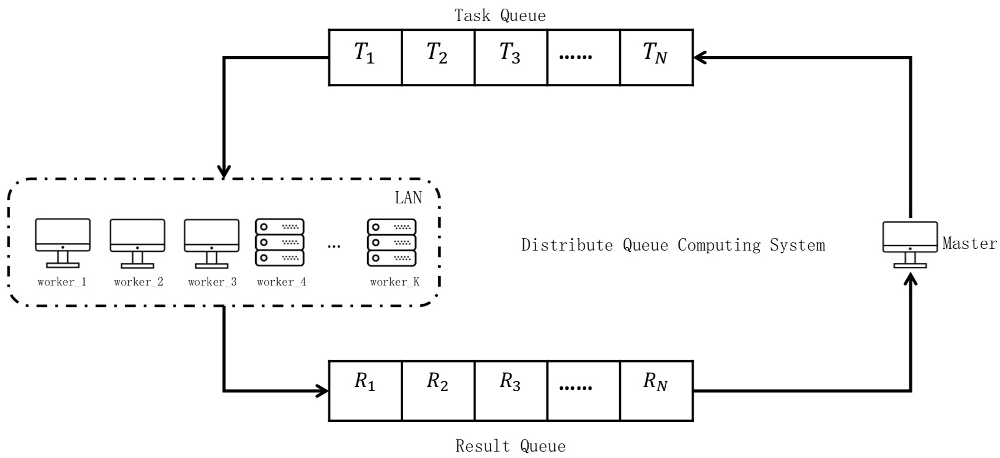

# 分布式队列计算系统(Distributw Queue Computing System)





## 开始（Getting Started）

These instructions will get you a copy of the project up and running on your local machine for development and testing purposes. See deployment for notes on how to deploy the project on a live system.

这些说明将为您提供在本地计算机上启动和运行的项目副本，以进行开发和测试。 有关如何在实时系统上部署项目的说明，请参阅部署

### 预备条件（Prerequisites）

Python3.5+

### 跑一个测试实例（Running the tests）

```
python manager.py
```

```
python worker_1.py
```

```
python worker_2.py
```

### 结果（result）

